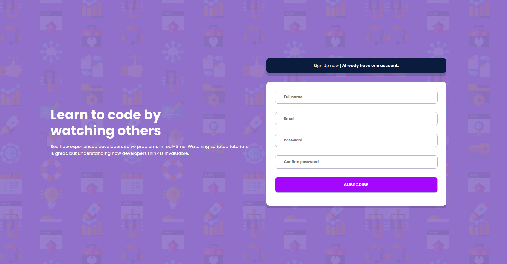

<h1 align="center"> Rick and Morty </h1>

  Desafio realizado proposto por uma vaga no qual me candidatei.

  <a href="#tecnologies">Tecnologias</a>&nbsp;&nbsp;&nbsp;|&nbsp;&nbsp;&nbsp;
  <a href="#project">Projeto</a>&nbsp;&nbsp;&nbsp;|&nbsp;&nbsp;&nbsp;
    <a href="#orientations">Orientações</a>&nbsp;&nbsp;&nbsp;|&nbsp;&nbsp;&nbsp;
  <a href="#challenges">Desafios</a>&nbsp;&nbsp;&nbsp;|&nbsp;&nbsp;&nbsp;
  <a href="#extres">Extras</a>&nbsp;&nbsp;&nbsp;

  

 

  

## 🚀 Tecnologias

 Esse projeto foi desenvolvido com as seguintes tecnologias: 

- HTML e CSS;
- PHP;
- Slim Framework;
- MySQL.

## 💻 Projeto

 Um projeto do Front-End Mentor realizado por mim para treinar as habilidades de CSS e principalmente para testar/conhecer o Slim Framework que nada mais é como o nome já diz, um framework de PHP.

## 🗺️ Orientações

 Você precisa ter apenas o Composer instalado em sua máquina para instalar as dependências necessárias e o Banco de Dados MySQL.

<ul style="margin-left: 20px">
  <li> Execute em seu terminal o comando "composer install";</li>
  <li> É necessário ter uma tabela MySQL chamada "users" com os campos: "id", "name", "email", "password" e "created_at".</li>
</ul>

## ⚔️ Desafios enfrentados

    O unico desafio foi entender como funciona o Slim Framework, não tive grandes dificuldades, como o projeto é simples não teve mais que um.

## 🧑‍🔧 Extras

 
    Fique a vontade para realizar qualquer tipo de mudança que você desejar.

